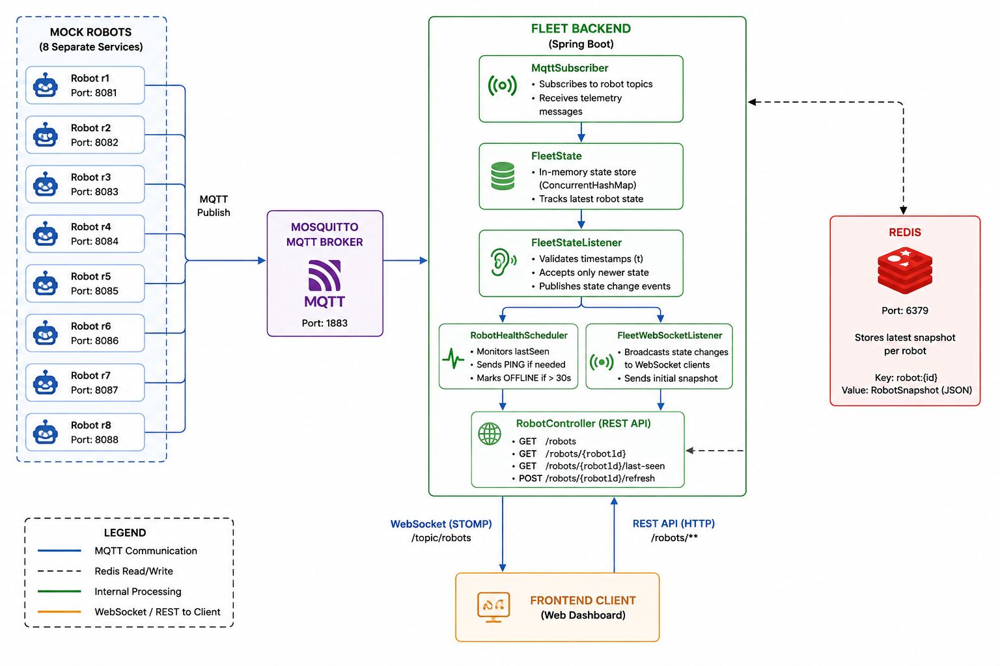

# System Design

## 1. What happens if we ask you to add a new feature to this later? Does your current design accommodate that, or does it need a rework? Walk through a specific feature and where it would plug in.

The current design is intentionally event-driven, so a new feature can generally be added without changing the MQTT ingestion or REST/WebSocket layers. For example, if we wanted to add robot history, `FleetStateListener` is the natural integration point. It already receives `FleetUpdateEvent` and decides whether an incoming update represents a newer state. After accepting the update, it could publish a separate event or call a history service to persist that state change. A `RobotHistoryService` could then store the accepted changes and `RobotController` could expose them through `/robots/history/{robotId}`. This means history can be added without changing `MqttSubscriber` or the mock robot implementation.

The same event-based approach can support other features such as alerts or metrics. For example, an alert listener could consume `FleetStateUpdatedEvent` and detect conditions such as low battery or an `ERROR` status. The main area that would eventually need rework is persistence and state coordination if the backend is scaled horizontally; the current `ConcurrentHashMap` in `FleetState` is deliberately local because the current assignment runs a single backend instance.

## 2. What happens if the number of robots grows a lot, say from eight to five hundred? What is the first thing that breaks, and why that specifically?

The first concern would be the backend's single-instance state and processing model rather than the MQTT protocol itself. `FleetState` currently stores every robot in a local `ConcurrentHashMap`, so it works well for the current eight robots, but with hundreds of robots the backend becomes a single point of failure and a single processing bottleneck. The `RobotHealthScheduler` also scans every robot periodically, so its work grows linearly with the number of robots.

I would first move state/update coordination to a shared store such as Redis and allow multiple backend instances to consume the MQTT stream. The update acceptance logic currently in `FleetStateListener` would need to become consistent across instances so that duplicate or out-of-order messages cannot result in conflicting state. WebSocket fanout would also need shared pub/sub or another event distribution mechanism so that a robot update received by one backend instance reaches clients connected to other instances. MQTT topic structure and broker capacity would then be evaluated as the fleet grows further.

## 3. What happens if bandwidth is limited and robots and the backend can only exchange a small amount of data per second? What would you change about what you send, how often, or how much detail it carries?

The current mock robots publish complete state updates containing fields such as position, battery, status, and timestamps. Under a strict bandwidth limit, I would reduce both the frequency and size of these messages. The robot could publish a compact telemetry message containing only values that changed, or separate high-frequency position updates from lower-frequency fields such as battery and status. For example, battery might only be reported when it changes by a meaningful threshold, while position could be sampled at a lower rate when the robot is stationary.

On the backend, `MqttSubscriber` could decode these compact updates and reconstruct the current `Robot` state in `FleetState`. WebSocket messages could similarly contain only the changed robot rather than the entire fleet, which is already how `FleetWebSocketListener` currently behaves. If bandwidth became extremely constrained, updates could also be batched or throttled so that intermediate position changes are dropped while the latest state is retained.

## 4. What happens if a robot goes down mid task and stops responding? What should the rest of the system do about it, and how would it even find out?

The backend currently detects this through `RobotHealthScheduler`. Every accepted robot update records `lastSeen` using the backend's receipt time in `MqttSubscriber`, rather than trusting the robot's timestamp. If no update is received for more than 30 seconds, the scheduler considers the robot offline. Before doing that, it stores the last known robot state in Redis with `t = -1`, while the in-memory `FleetState` is changed to `OFFLINE`. A `FleetStateUpdatedEvent` is then published so the WebSocket dashboard immediately reflects the offline state.

The rest of the system therefore sees the robot as `OFFLINE` rather than incorrectly assuming that its last reported task state is still current. The scheduler also sends PING messages when a robot has not been heard from for a shorter period. Once the robot reconnects and starts publishing again, its timestamp can restart from `t = 0`; the `t = -1` reset allows that new sequence to be accepted by `FleetStateListener` and the Redis persistence listener.

## 5. What happens if the connection between a robot and the backend is slow or unreliable, and updates arrive late, out of order, or not at all for a while? What does the rest of the system see during that time, and how does it recover once the connection is healthy again?

The system separates the robot event timestamp `t` from `lastSeen`, which is the time the backend actually received the message. `FleetStateListener` uses `t` to reject stale or out-of-order updates, so a delayed older message cannot overwrite a newer state. At the same time, `RobotHealthScheduler` uses `lastSeen` to determine whether communication with the robot has stopped. This means a robot can temporarily have an old-looking state without the backend incorrectly accepting delayed messages as newer state.

For short communication gaps, the scheduler sends PING requests. If the robot remains silent for more than 30 seconds, the backend marks it `OFFLINE` and notifies WebSocket clients. When communication recovers, the robot's newer updates are accepted normally. The Redis snapshot also provides recovery across backend restarts, while resetting `t` to `-1` when a robot is declared offline allows a restarted robot's new event sequence beginning at `t = 0` to be accepted instead of being rejected as stale.

---
